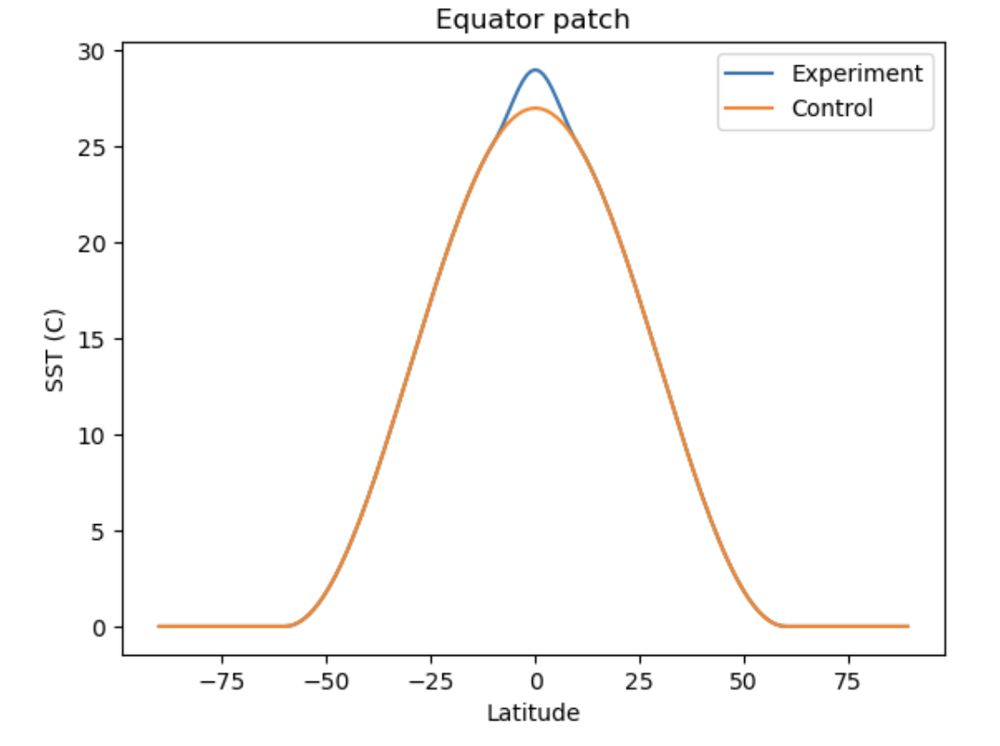
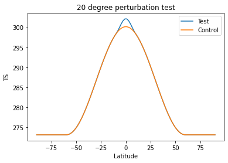

# Aquaplanet with a fixed SST

Now that you've ported CESM successfully to Keeling and have been able to validate your port and run some example tests, where do you start? With this example, hopefully you can get a sense for how you can adjust parameters within CESM and run tests.

__This tutorial assumes you've been able to complete [porting](../porting_cesm.md) and [out of the box capability](../out_of_the_box_capability.md).__

## Introduction

An aquaplanet component set is typically an atmosphere only model where it's assumed that the Earth is a ball of water with no land and usually no sea ice. This simplified model can help us parse atmospheric interactions with the surface ocean very easily.

Here, we'll be going over how to change the sea surface temperature in order to see how the atmosphere is disturbed.

This tutorial partially follows the [UCAR example for the CAM5 physics model](https://www.cesm.ucar.edu/models/simple/aquaplanet).

## Creating a new case

Like usual, you'll want to start with creating a case in `cesm1.2.1/scripts`:

` ./create_newcase -case aqua_testperturb -compset FC5AQUAP -res f19_f19 -mach keeling `

 - **-case aqua_testperturb**: This is the case name, which you can set to anything. Here, it's aqua_testperturb
 - **-compset FC5AQUAP**: This is the component set. We're using the CAM5 aquaplanet compset.
 - **-res f19_f19**: Our resolution. Ours is around 2 deg. x 2 deg.
 - **-mach keeling**: Our machine that we set up [here](../out_of_the_box_capability.md). 

## Changing the sea surface temperature

For the purposes of this example, we want to change our sea surface temperature (which is fixed throughout the whole simulation) so that it's slightly hotter at the equator, like below. (Plotted with Python)



Each variable is different in how it can be changed. Many can be changed through using xml files given in the case directory. However, sea surface temperature (SST) must be manually changed.

Go to `/cesm1.2.1/models/atm/cam/src/utils/cam_aqua/ocn_comp.F90 `

This fortran file has many kinds of sea surface conditions to choose from, which you do by setting sst_option in the interface near the top of the script.

First, save a copy of the original `ocn_comp.F90` file for reference: `cp ocn_comp.F90 /cesm1_2_1/scripts/aqua_testperturb/SourceMods/src.aquap`

In `ocn_comp.F90`, we'll edit SST option 6 since it's closest to what we want. We'll write out in Fortran the specific perturbation we want.

The formula is:

$$ SST_{exp}(\phi) = SST_{control}(\phi) + Acos^2(\frac{\pi}{2}\frac{\phi - \phi_p}{\phi_w}) $$

where $\phi$ is latitude, $\phi_p$ is where the peak of our perturbation will be (equator), and $\phi_w$ is the width (10 degrees latitude).
```
if(sst_option == 6) then
   do lchnk=begchunk,endchunk
      call get_rlat_all_p(lchnk,pcols,rlat)
      call get_rlon_all_p(lchnk,pcols,rlon)
      ncols = get_ncols_p(lchnk)
      do i=1,ncols
         if(abs(rlat(i)) < lat00+latrad10 .AND. abs(rlat(i)) > lat00-latrad10) then
            tmp1 = cos((abs(rlat(i))-lat00)*pi*0.5_r8/latrad10)
            tmp1 = tmp1*tmp1
            sst(i,lchnk) = sst(i,lchnk) + t_2*tmp1
         end if
      end do
   end do
end if
```

Make sure to change all relevant variables to the values you want. `latrad10` ($\phi_w$) is 10._r8\*pio180, `t_2` (A) is 2._r8, and `lat00` ($\phi_p$) is 0._r8\*pio180 (equator).

sst(i,lchnk) is initially the control SST.

## Building the case

You can go back to your case directory (`/cesm1.2.1/scripts/aqua_testperturb`) and run `./cesm_setup` now.

If you find yourself needing to redo the SST after having already done this, you can run 
```
./cesm_setup -clean
./cesm_setup
```
 after rewriting `ocn_comp.F90`. This should refresh the SST and allow you to run with the newly adjusted values.

 We want to fix the orbit to certain values to follow the example of other CESM aquaplanet simulations. In `user_nl_cpl`, add these following lines to the end:
 ```
orb_eccen = 0.
orb_obliq = 0.
orb_mvelp = 0.
orb_mode  = 'fixed_parameters'
```

In the `env_build.xml` need to set using xmlchange command
```
<entry id="CAM_CONFIG_OPTS"   value="-phys cam5 -ocn aquaplanet -microphys mg1.5"  />
```
Build the case: `./aqua_poleperturb.build`

If the build fails, fix any errors and then clean before building again: `./aqua_poleperturb.clean_build`.

## Testing the Input
We plan to run the simulation for 20 years. But this takes a while, and what if our input wasn't put in correctly? It might be best then to run a very short simulation first in order to validate that the input is correct.

In `env_run.xml`:
```
<!--"sets the run length with STOP_N and STOP_DATE (must be nyear(s) for _GLC compsets for restarts to work properly), valid values: none,never,nsteps,nstep,nseconds,
nsecond,nminutes,nminute,nhours,nhour,ndays,nday,nmonths,nmonth,nyears,nyear,date,ifdays0,end (char) " -->
<entry id="STOP_OPTION"   value="ndays"  />

<!--"sets the run length with STOP_OPTION and STOP_DATE (integer) " -->
<entry id="STOP_N"   value="50"  />
```
Note:use command to change the xml files~ `./xmlchance entry_id=value`

Example:

```
./xmlchange STOP_OPTION=ndays
```

The simulation will run for 50 days, which should take an hour or two on Keeling compared to the 3 days that 20 years can take.

Additionally, in `env_run.xml`, set:
```
<!--"CAM namelist use_case (char) " -->
<entry id="CAM_NML_USE_CASE"   value="aquaplanet_cam5"  />
```
to make sure we're using cam5 physics.

Now we can let the simulation run: `sbatch aqua_poleperturb.run`

If you've set up your output like [here](../out_of_the_box_capability.md), you should find your output in `$OUTPUT_ROOT/aqua_testperturb/outputdata/atm/hist`.

Try plotting surface temperature:
```
import xarray as xr
import matplotlib.pyplot as plt

test = xr.open_dataset('/data/keeling/a/mailes2/a/CESM_DATA/aqua_equator20wide/outputdata/atm/hist/aqua_equator20wide.cam.h0.0001-02.nc')
control = xr.open_dataset('/data/keeling/a/pappup2/a/CESM/cam5_new/CESM_output_data/atm/hist/cam5_new.cam.h0.0005-12.nc')
control_TSmean = control.TS.mean('lon')
test_TSmean = test.TS.mean('lon')
```



(Control isn't needed, but it's here for reference)

If the SST input looks good, you can now run your simulation for the full twenty years!

```
<!--"sets the run length with STOP_N and STOP_DATE (must be nyear(s) for _GLC compsets for restarts to work properly), valid values: none,never,nsteps,nstep,nseconds,
nsecond,nminutes,nminute,nhours,nhour,ndays,nday,nmonths,nmonth,nyears,nyear,date,ifdays0,end (char) " -->
<entry id="STOP_OPTION"   value="nyears"  />

<!--"sets the run length with STOP_OPTION and STOP_DATE (integer) " -->
<entry id="STOP_N"   value="20"  />
```
`sbatch aqua_poleperturb.run`
## CONTINUE RUN
If you need to continue run more i.e., you run for 20 years first and you need total 30 years run in same setup, then you no need to creat new case and run 30 yeras from beginning. Instead you can continue run where you left before in this case 20 years.
```
<entry id="STOP_OPTION"   value="nyears"  />

<!--"sets the run length with STOP_OPTION and STOP_DATE (integer) " -->
<entry id="STOP_N"   value="10"  />


<entry id="CONTINUE_RUN"   value="TRUE"  />
```
